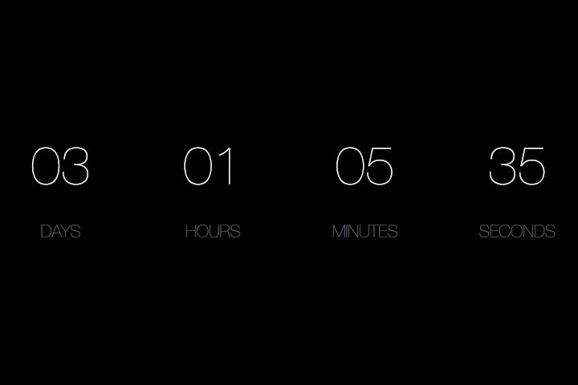

# Point in Time

Screensaver to count down to or up from a specific date and time.

Inspired by [Countdown](https://github.com/soffes/Countdown)

## Build from source
Visual Studio and .NET Framework 4.7.2+

## Installation
*Releases will follow in the feature.*

For now you can build the project from source, rename the created executable
from PointInTime.`exe` to PointInTime.`scr`. It is now a Windows screensaver file.

Right-click the screensaver file and click `Install`, this will open the
Windows screensaver settings, where you can go into the settings of the screensaver
to setup date and time.
